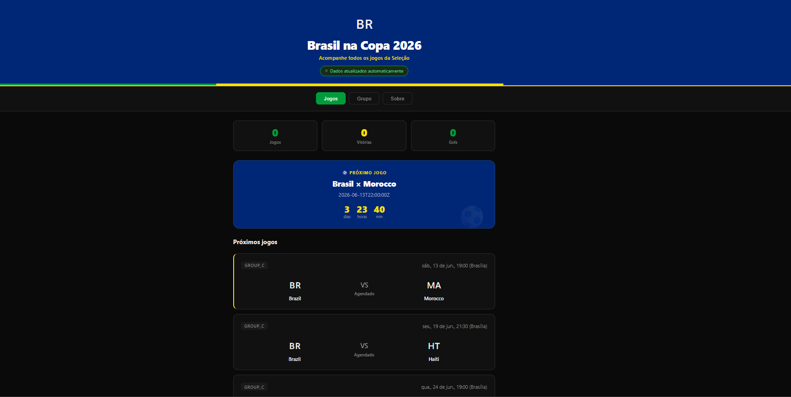

# 🇧🇷 Brasil na Copa 2026

Acompanhe todos os jogos da Seleção Brasileira na Copa do Mundo FIFA 2026 em uma interface moderna, responsiva e atualizada automaticamente.

O projeto consome uma API própria desenvolvida em Node.js que busca dados em tempo real da Football-Data.org e exibe informações como:

- Próximos jogos do Brasil
- Jogos ao vivo
- Resultados anteriores
- Classificação do grupo
- Estatísticas da campanha
- Contagem regressiva para o próximo jogo

---

## 📸 Preview



---

## 🚀 Tecnologias Utilizadas

### Frontend

- HTML5
- CSS3
- JavaScript (ES Modules)

### Backend

- Node.js
- Express.js

### Fonte dos Dados

- Football Data API

---

## 📂 Estrutura do Projeto

```text
brasil-copa-2026/
│
├── css/
│   └── style.css
│
├── js/
│   ├── api.js
│   ├── games.js
│   ├── standings.js
│   ├── ui.js
│   └── constants.js
│
├── assets/
│   └── preview.png
│
├── index.html
│
└── README.md
```

---

## ⚙️ Funcionalidades

### Jogos

- Exibição de todos os jogos do Brasil
- Destaque para partidas ao vivo
- Resultados finais
- Próximo jogo em destaque
- Contagem regressiva automática

### Grupo

- Tabela atualizada automaticamente
- Destaque para o Brasil
- Identificação dos classificados
- Saldo de gols calculado dinamicamente

### Atualização Automática

Os dados são atualizados automaticamente a cada 60 segundos.

---

## 🔌 API

O frontend consome os seguintes endpoints:

### Jogos

```http
GET /api/jogos
```

Resposta:

```json
{
  "matches": [...]
}
```

### Grupo

```http
GET /api/grupo
```

Resposta:

```json
{
  "standings": [...]
}
```

---

## 🛠️ Instalação

### 1. Clonar o repositório

```bash
git clone https://github.com/meuNobre/brasil-copa-2026.git
```

---

### 2. Entrar na pasta

```bash
cd brasil-copa-2026
```

---

### 3. Abrir o projeto

Você pode utilizar:

- Live Server (VS Code)
- Vercel
- Netlify
- GitHub Pages

---

## 🌎 Hospedagem

O frontend pode ser hospedado gratuitamente em:

- Vercel
- Netlify
- GitHub Pages

---

## 📱 Responsividade

O projeto foi desenvolvido para funcionar em:

- Desktop
- Tablet
- Smartphone

---

## 🎯 Objetivo

Este projeto foi criado para praticar:

- Consumo de APIs
- Organização de projetos Frontend
- Manipulação de dados esportivos
- Modularização em JavaScript
- Integração Frontend + Backend

---

## 🤝 Contribuições

Contribuições são bem-vindas.

1. Faça um Fork
2. Crie uma Branch

```bash
git checkout -b feature/minha-feature
```

3. Commit suas alterações

```bash
git commit -m "feat: minha nova feature"
```

4. Faça Push

```bash
git push origin feature/minha-feature
```

5. Abra um Pull Request

---

## ☕ Apoie o Projeto

Se este projeto foi útil para você, considere apoiar o desenvolvimento:

### Pix

```text
nobrecoding@gmail.com
```

ou

### GitHub Sponsors

https://github.com/sponsors/meuNobre

---

## 👨‍💻 Autor

João Miguel Nobre

- GitHub: https://github.com/meuNobre
- LinkedIn: https://linkedin.com/in/joao-miguel-nobre

---

## 📄 Licença

Este projeto está licenciado sob a licença MIT.

Consulte o arquivo LICENSE para mais detalhes.